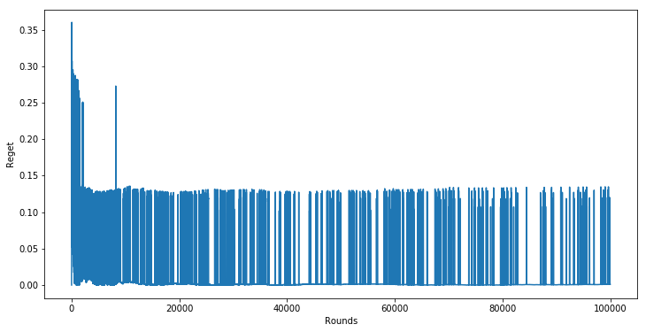
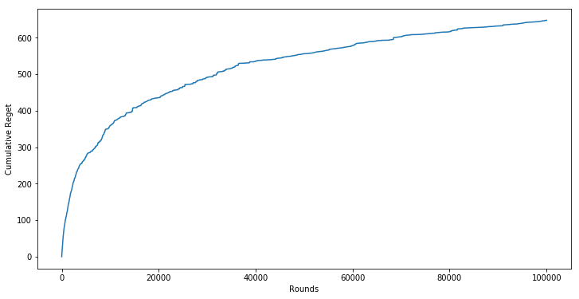
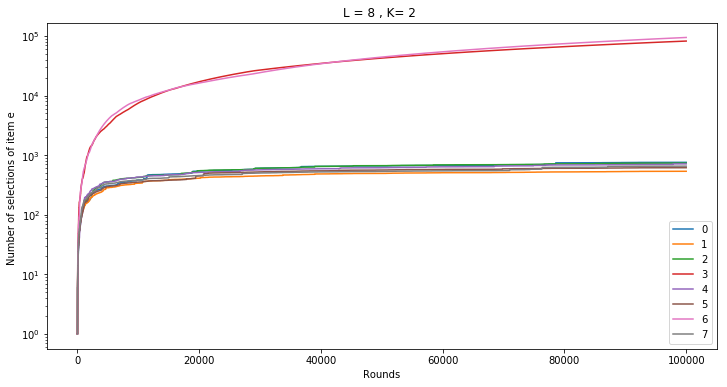

# CascadeBandit-UCB

The following repo is a python implementation of the [Cascading Bandits paper](https://arxiv.org/pdf/1502.02763.pdf).

## Main problem
Ranking and presenting web pages by attractiveness to user is very important problem. The search engine
has to ’learn’ the user behavior to output the most attractive items to a user from a set of web pages, where
attractiveness can usually be inferred from historical click data of the user. The paper presents a ’novel’ way
of modeling this interaction in an online setting based on the Cascade Model.
We could formulate a simpler setup where the search engine has to recommend the most attractive item. This
could easily be modeled as a stochastic bandit problem where each page/item has an unknown attractiveness
probability. This problem can be solved with classic stochastic algorithms like UCB1. The main difference
here is the combinatorial aspect of the problem where we need to recommend K items from L. The model
is related to a form of bandits problem where each recommendation is modeled as a separate independent
bandit. We call this type of modeling Ranked bandits, we will discuss the differences between Ranked
bandits and Cascade bandit.

## Single run

To test the result presented by the paper, I implemented the algorithm CascadeUCB described above in
algorithm 1.3. The U CB computation was based on CascadeUCB1. The implementation code details can be
found in appendix A. Running the code for L = 8, K = 2, ∆ = 0.15, p = 0.2 and for n = 105 rounds we
clearly see a convergence as the cumulative regret stabilizes.

    100%|██████████| 99999/99999 [00:08<00:00, 12166.25it/s]

# Analysis

    

    

    

    
Plotting the selected item e by rounds on a logarithmic scale on the y-axis in figure 2, we clearly see that
the algorithms stops selecting sub-optimal items (items from 2 to 8).

## Cumulative item selections

    

    

## Experiment with multiple runs

We do in fact retrieve the upper bounds of the regret in equation 4. The regret increases linearly in L − K.
When doubling the number of items L, the regret doubles. Increasing K with a constant number of items
shows that the regret decreases. The regret also decreases when ∆ increases, confirming the 1/∆ factor in
the upper bound.

    L= 16 , K= 2,delta =0.15: 100%|██████████| 5/5 [00:00<00:00, 57.53it/s]
    L= 16 , K= 4,delta =0.15: 100%|██████████| 5/5 [00:00<00:00, 60.38it/s]
    L= 16 , K= 4,delta =0.075: 100%|██████████| 5/5 [00:00<00:00, 58.38it/s]
    L= 8 , K= 2,delta =0.075: 100%|██████████| 5/5 [00:00<00:00, 76.36it/s]

<table border="1" class="dataframe">
  <thead>
    <tr style="text-align: right;">
      <th></th>
      <th>L</th>
      <th>K</th>
      <th>delta</th>
      <th>mean</th>
      <th>std</th>
    </tr>
  </thead>
  <tbody>
    <tr>
      <th>0</th>
      <td>16</td>
      <td>2</td>
      <td>0.150</td>
      <td>24.096475</td>
      <td>2.540551</td>
    </tr>
    <tr>
      <th>1</th>
      <td>16</td>
      <td>4</td>
      <td>0.150</td>
      <td>29.094590</td>
      <td>4.761885</td>
    </tr>
    <tr>
      <th>2</th>
      <td>16</td>
      <td>4</td>
      <td>0.075</td>
      <td>20.042619</td>
      <td>1.931034</td>
    </tr>
    <tr>
      <th>3</th>
      <td>8</td>
      <td>2</td>
      <td>0.075</td>
      <td>15.488652</td>
      <td>1.809575</td>
    </tr>
  </tbody>
</table>

